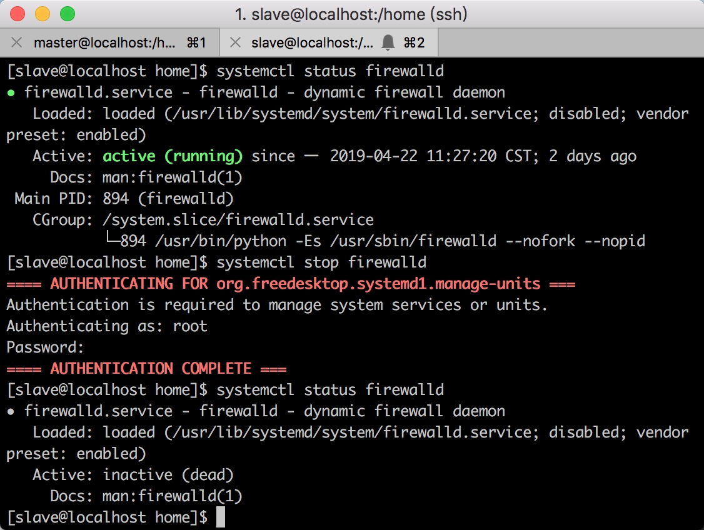
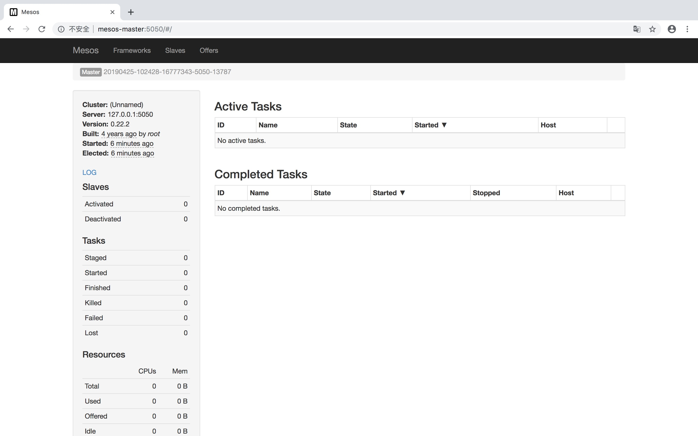

# 前置工作

## 各节点更改username
-  /etc/passwd
-  /etc/shadow
-  /etc/group
-  /etc/gshadow
-  /home下修改用户文件名


## 防火墙关闭并设置开机不启动
- `$ systemctl stop firewalld`
- `$ systemctl disable firewalld`
- `$ systemctl status firewalld`



## Select ip


## Remote login

# 安装Mesos

## 使用安装包安装Mesos
- `$ sudo rpm -Uvh http://repos.mesosphere.io/el/7/noarch/RPMS/mesosphere-el-repo-7-1.noarch.rpm`

新用户无法使用sudo来下载安装rpm安装包


新用户加入sudo权限重新安装


- masters上安装Mesosphere的ZooKeeper安装包
`$ sudo yum -y install mesos-0.22.2-0.2.62.centos701406 mesosphere-zookeeper`

- slaves上执行
`$ sudo yum -y install mesos-0.22.2-0.2.62.centos701406`

# 配置ZooKeeper

## 配置文件zoo.cfg
- 通过安装包安装的配置文件在/etc/zookeeper/conf/zoo.cfg下。
- 通过源代码编译安装的话，假设你讲安装目录设置在/usr/local/zookeeper-3.4.5，那么配置文件就在/usr/local/zookeeper-3.4.5/conf/zoo.cfg下。

修改配置如下：


## 为什么ZooKeeper集群模式节点数必须为奇数且3个及以上？
- zookeeper集群的写操作，由leader节点负责，它会把通知所有节进行写入操作，只有收到半数以上节点的成功反馈，才算成功。如果是部署2个节点的话，那就必须都成功。
- zookeeper的选举策略也是需要半数以上的节点同意才能当选leader，如果是偶数节点可能导致票数相同的情况。
- 只有当半数以上的节点存活时 zookeeper集群才能对外服务，维持正常状态，如果是2个节点，只要其中一个挂掉，那么剩下的1个并不满足半数以上规则。
- zookeeper有这样一个特性：集群中只要有过半的机器是正常工作的，那么整个集群对外就是可用的。也就是说如果有2个zookeeper，那么只要有1个死了zookeeper就不能用了，因为1没有过半，所以2个zookeeper的死亡容忍度为0；同理，要是有3个zookeeper，一个死了，还剩下2个正常的，过半了，所以3个zookeeper的容忍度为1；同理你多列举几个：2->0;3->1;4->1;5->2;6->2会发现一个规律，2n和2n-1的容忍度是一样的，都是n-1，所以为了更加高效，何必增加那一个不必要的zookeeper呢。

## 配置myid文件
如果是集群模式，除了zoo.cfg配置文件以外，还需为zookeeper集群中的每个节点分配一个唯一ID，即server.1,server.2......server.A，A就是节点ID。

`$ echo 1 > /etc/zookeeper/conf/myid`

## start service and check!

开启zookeeper服务：  
`$ service zookeeper start`  

通过Netcat发送一个健康检查的命令确保zookeeper服务处于健康状态。发送一个ruok命令，它会回复一个imok的指示：  
`$ echo ruok | nc 127.0.0.1 2181`


# Messos配置
到现在ZooKeeper集群已经搭建好了并且可以为Mesos提供服务了，来看下Mesos的配置。  
这里提供的配置已经足够让集群来处理分布式负载了，但是不会包含Mesos提供的所有配置。可以在如下网站找到Mesos的最新配置信息：  
[Mesos官方文档-最新配置信息](http://mesos.apache.org/documentation/latest/configuration)

## 


## master配置
为了让mesos-master能正常工作，有几个配置项是必需的，他们是：ZooKeeper的URL，Mesos master的法定数量，Mesos master的工作目录。

- 选项--zk是ZooKeeper的URL，用来在master之间做领导者选举和协调。这个选项是在高可用的部署使用的，如果单独运行Mesos的话不需要。ZooKeeper的URL使用下面的格式：

```
zk://mesos-master-1.example.com:2181,
     mesos-master-2.example.com:2181,
     mesos-master-3.example.com:2181/mesos
```      

如果你在ZooKeeper机群里启动了认证功能的话，可以在URL里面指定用户和密码，也可以在磁盘的文件上指定包含你认证细节的ZooKeeper URL，如下：

```
zk://username:password@host1:2181,host2:2181,host3:2181/mesos
file:///pat/to/zk_url
```

- 选项--quorum指定了Mesos master集群里面的选举票数，并且勇于Mesos复制注册。

配置法定数目选项时，确保Mesos master节点数目根据如图对应保持一致。任何额外的masters都会违反这个法定数目，并且损坏复制的日志。

| master数目  | 法定数目 | 可容忍的失败机器数 |
| --- | :--- | :---: |
| 1  | 1 | 0 |
| 3  | 2 | 1 |
| 5  | 3 | 2 |
| 2N-1  | N | N-1 | 

- 选项--work_dir指定了Mesos自身存放复制日志的目录。这个选项没有默认的，所以必须指。通常情况类似这样的/var/lib/mesos是一个好的设定。
- 选项--log_dir尽管不是必须的，但是这样的设定也是个好的选择。确保Mesos会向磁盘上输出事件信息，就可以轻易的调试Mesos集群了。Mesosphere提供的安装包已经将log_dir设置在/var/log/mesos目录下面了。

根据源代码安装Mesos的一个mesos-master-env.sh脚本如下：

```
export MESOS_zk=zk://mesos-master-1.example.com:2181,  
     mesos-master-2.example.com:2181,
     mesos-master-3.example.com:2181/mesos
export MESOS_quorum=2
export MESOS_work_dir=/var/lib/mesos
export MESOS_log_dir=/var/log/mesos
```   

## 启动master，关闭slave服务

`$ sudo service mesos-master start`
`$ sudo systemctl disable mesos-slave.service`


check service
`http://mesos-master:5050`



## slave配置
为了让mesos-slave正常工作，有几个配置项也是必须的，特别是ZooKeeper的URL，Mesos slave的工作目录。

- 选项--master指定了ZooKeeper的URL，master slave通过它检测leading master和连接到整个集群中。同master配置，ZooKeeper的URL使用下面的格式：  

```
zk://mesos-master-1.example.com:2181,
     mesos-master-2.example.com:2181,
     mesos-master-3.example.com:2181/mesos
```      

- 选项--work_dir在slave的环境中指定了Mesos framework的工作目录和沙盒所在。它是没有默认设置的，所以是个必须设置的一个选项。通常设置为/var/lib/mesos，同时保证他不是放在那种类似/tmp的分区上面就更好了。
- 选项--log_dir，同master配置

## 启动slave，关闭master服务
`$ sudo service mesos-slave start`
`$ sudo systemctl disable mesos-master.service`